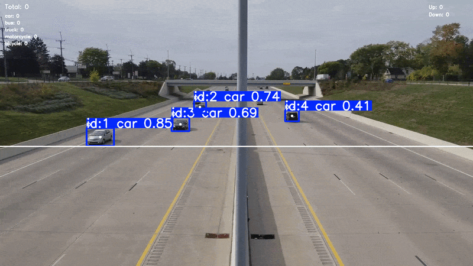
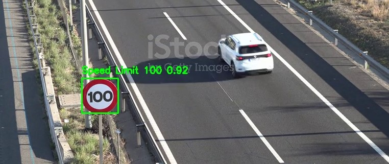
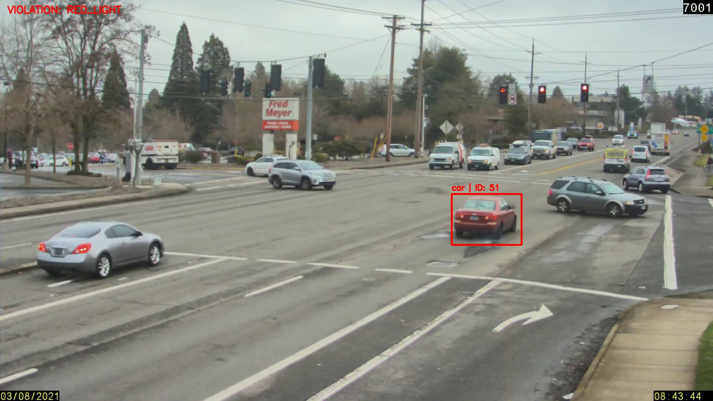

# Intelligent Traffic Monitoring & Violation Detection System

An AI-powered traffic monitoring system for detecting, tracking, and analyzing vehicles in road traffic videos.

The system combines object detection, multi-object tracking, vehicle counting, direction estimation, speed estimation, traffic-light detection, and traffic-violation analysis into a unified video-processing pipeline.

## Features

* Vehicle detection using YOLO
* Multi-object tracking using ByteTrack
* Vehicle counting
* Vehicle direction estimation
* Road calibration
* Wrong-way driving detection
* Vehicle speed estimation
* Speed-limit violation detection
* Traffic-light detection
* Red-light violation detection
* Automatic violation evidence collection
* Centralized violation management
* Streamlit web interface — currently under development

## System Pipeline

The system processes traffic videos through a unified pipeline:

```text
Input Video
    │
    ▼
Vehicle Detection
    │
    ▼
ByteTrack Tracking
    │
    ├── Vehicle Counting
    ├── Direction Estimation
    └── Speed Estimation
    │
    ▼
Violation Detection
    ├── Wrong-Way Detection
    ├── Speed Violation
    └── Red-Light Violation
    │
    ▼
Evidence Collection
    │
    ▼
Output Video / Violation Evidence
```

## Project Structure

```text
Intelligent Traffic Monitoring & Violation Detection System/
│
├── app/
│
├── configs/
│   ├── calibrations/
│   ├── road_config.json
│   ├── road_config_loader.py
│   └── traffic_config.py
│
├── models/
│   ├── detection/
│   │   └── final_yolo11n.pt
│   └── traffic_sign/
│       └── best.pt
│
├── src/
│   ├── analytics/
│   ├── core/
│   ├── detection/
│   ├── evidence/
│   ├── pipeline/
│   ├── tracking/
│   ├── utils/
│   └── violations/
│
├── .gitignore
├── LICENSE
├── README.md
└── requirements.txt
```

> The `data/`, `outputs/`, and `tests/` directories are excluded from the repository because they contain local datasets, generated files, and development/testing resources.

The Streamlit interface is currently under development and will be added to the `app/` directory.

## Demo

### Vehicle Tracking


### Vehicle Counting



### Speed-Limit Sign Detection



### Red-Light Violation Detection



## Technologies

* Python
* PyTorch
* Ultralytics YOLO
* OpenCV
* NumPy
* ByteTrack

## Models

The project uses YOLO-based models for vehicle and traffic-sign detection.

### Vehicle Detection

The final vehicle detection model is:

```text
models/detection/final_yolo11n.pt
```

### Traffic Sign Detection

The traffic-sign detection model is:

```text
models/traffic_sign/best.pt
```

The models used in the final system are included in the repository.

## Datasets

Three datasets were used during the development of the system.

### 1. Road Traffic Dataset

[LibreYOLO - Road Traffic](https://huggingface.co/datasets/LibreYOLO/road-traffic)

This dataset was used for general road-traffic object detection, including vehicles, motorcycles, bicycles, traffic lights, and crosswalks.

### 2. Traffic Vehicle Dataset

[Traffic Vehicle Detection](https://universe.roboflow.com/padmavathis-workspace/traffic-vehicle-7lcvb-vjd2e)

This dataset was used to provide additional vehicle classes and training samples.

The first two datasets were merged into a unified dataset for the main vehicle and traffic-object detection model.

During preprocessing, the datasets were:

* Class-mapped into a common label scheme
* Converted into a unified YOLO detection format
* Combined while preventing filename conflicts
* Validated for missing labels and invalid bounding boxes
* Organized into unified train, validation, and test splits

### 3. Traffic Speed-Limit Sign Dataset

[Traffic Speed-Limit Sign Dataset](https://www.kaggle.com/datasets/pkdarabi/cardetection/data)

This dataset was used separately for the traffic-sign detection model, which is responsible for detecting speed-limit signs used by the speed-violation component.

The datasets themselves are **not included in this repository** because of their size and dataset distribution/licensing considerations.

The dataset preparation and validation scripts are included in:

```text
src/utils/
```

## Data Preprocessing

The project includes several utilities for dataset preparation, analysis, and validation.

Examples include:

```text
src/utils/
├── analyze_labels.py
├── create_validation_split.py
├── inspect_dataset.py
├── merge_datasets.py
└── validate_unified_dataset.py
```

These utilities were used to analyze class distributions, prepare dataset splits, merge different datasets, remap classes, convert label formats, and validate the final unified dataset.

## Configuration

Traffic and road-related settings are stored under:

```text
configs/
```

The main traffic configuration is:

```text
configs/traffic_config.py
```

Road-specific calibration settings are stored under:

```text
configs/calibrations/
```

These configurations control parameters such as:

* Detection confidence
* Image size
* Vehicle classes
* Speed measurement lines
* Reference distance
* Speed limit
* Road type

## Running the Pipeline

The main traffic-processing pipeline is implemented in:

```text
src/pipeline/traffic_pipeline.py
```

The pipeline can be imported and used from a Python script:

```python
from src.pipeline.traffic_pipeline import TrafficPipeline

pipeline = TrafficPipeline(
    video_path="path/to/video.mp4",
    road_type="two_way",
    enabled_violations=[
        "wrong_way",
        "speeding",
        "red_light",
    ],
)

pipeline.run_video(display=True)
```

Replace the video path with the path to your local traffic video.

## Output

The system can generate:

* Processed traffic videos
* Vehicle tracking information
* Vehicle counts and direction information
* Speed measurements
* Violation records
* Violation evidence images

Generated files are stored locally and excluded from Git where appropriate.

## Limitations

The accuracy of direction, speed, and traffic-violation detection depends on several factors, including:

* Camera position
* Video resolution
* Road configuration
* Vehicle visibility
* Lighting conditions
* Calibration accuracy

Speed estimation in particular depends on the configured road reference distance and measurement lines.

## Future Development

The project is currently being extended with a Streamlit-based web interface to provide a user-friendly interface for running the traffic-monitoring pipeline.

## License

This project is licensed under the MIT License.

See the `LICENSE` file for more information.
